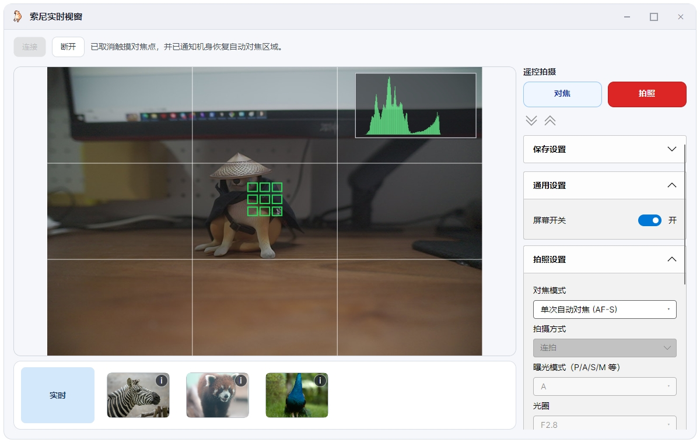

# SonySmartControl — 索尼相机遥控实时视窗（Windows）

本仓库在 **Windows x64** 上基于索尼官方 **Camera Remote SDK（CrSDK）** 实现桌面端实时取景、遥控拍摄与常用拍摄参数同步。托管 UI 使用 **Avalonia 11**，原生桥接层将 CrSDK C++ API 封装为可供 C# 调用的 `SonyCrBridge.dll`。

## 界面预览


## 交流群
![[QQ群.jpg]]
---

## 兼容性与验证范围（重要）

| 项目 | 说明 |
|------|------|
| **开发验证机身** | 开发与日常联调使用的机身为 **索尼 α7C II（ILCE-7CM2）**。以下功能路径、属性码、固件行为均在该机型上验证。 |
| **其他索尼机型** | CrSDK 为通用接口，理论上支持官方兼容列表内的多款机型，但 **不同机身在设备属性（Device Property）、遥控触摸、连拍/快门逻辑、DISP 背屏等能力上存在差异**。本仓库 **不保证** 所有索尼相机均能获得相同体验；若出现异常，请以机身菜单与官方 SDK 文档为准。 |
| **官方依据** | 功能实现参考 SDK 附带的 **RemoteCli** 示例与 **CrSDK API Reference**（如 `CrDeviceProperty_*`、`SetDeviceProperty`、`SendCommand` 等）。 |

建议在目标机型上自行验证：连接方式（USB / 有线网络等）、「PC 遥控」相关菜单、保存到电脑权限等。

---

## 仓库结构

| 组件                   | 路径                                    | 作用                                                                                                                             |
| -------------------- | ------------------------------------- | ------------------------------------------------------------------------------------------------------------------------------ |
| **SonySmartControl** | `SonySmartControl/`                   | Avalonia 桌面应用：实时预览、侧栏拍摄/保存设置、胶片条回看等。                                                                                           |
| **SonyCrBridge**     | `SonyCrBridge/`                       | CMake + MSVC 工程，输出 **`SonyCrBridge.dll`**：封装连接、Live View、半按/释放快门、设备属性读写、部分 JSON 状态查询等。                                         |
| **CrSDK 资源**         | `CrSDK_v2.01.00_20260203a_Win64/`（示例） | 官方包解压目录，需包含 **`RemoteCli\app\CRSDK`** 与 **`RemoteCli\external\crsdk`**（含 `Cr_Core.dll` 等）。路径可通过 MSBuild 属性 `SonyCrSdkRoot` 覆盖。 |

---

## 功能概览（SonySmartControl）

以下为当前实现的主要能力摘要（具体以界面与代码为准）：

- **连接与实时预览**：通过 CrSDK 枚举/连接相机，拉取 Live View JPEG 并显示；可选直方图与构图辅助线叠加。
- **遥控拍摄**：侧栏「对焦」「拍照」模拟半按 / 全按逻辑；**单张**与 **连拍** 驱动模式下行为区分（连拍为按住保持快门释放键、松手停止）。
- **拍摄参数同步**：曝光模式、光圈、快门、ISO、曝光补偿、对焦模式、快门类型（机械/电子等）、**驱动模式（单张 / 连拍速度 / 延时自拍）** 等，以轮询 JSON 从机身同步并回写（依赖 `SonyCrBridge` 提供的属性码与数据类型）。
- **保存到 PC**：保存目录、文件名前缀、JPEG/RAW 等格式；与机身「静态影像存储目标」及 RAW+JPEG 传 PC 等相关属性对齐（见 `SonyCrSdk.ApplyCaptureSaveSettings` 等）。
- **其他**：遥控触摸对焦、背屏 DISP 开关（依赖桥接实现）、底部胶片条最近成片扫描等。

若升级 **CrSDK 大版本**，请对照官方头文件核对 `CrDeviceProperty` 枚举数值（历史上曾出现属性码抄写错误导致写入错误寄存器的情况）。

---

## 环境与依赖

### 运行环境

- **操作系统**：Windows 10/11 x64（与官方 CrSDK Win64 包一致）。
- **.NET**：当前工程目标框架为 **.NET 10**（`net10.0`），需安装对应 **SDK** 以编译；运行端需 **.NET 10 Desktop Runtime（x64）**（若仅分发可执行文件）。
- **VC++ 运行库**：建议安装 Visual C++ 可再发行组件（x64），以便加载 CrSDK 及桥接 DLL。

### 编译 SonyCrBridge 所需

- **CMake**（Visual Studio 自带或独立安装均可）。
- **Visual Studio 2022**（含「使用 C++ 的桌面开发」工作负载），用于生成 MSVC 工程并编译 **x64 Release** 的 `SonyCrBridge.dll`。

### 相机与线缆

- 机身需支持官方 **Camera Remote SDK** 所列连接方式；USB 连接时需按官方说明安装驱动、设置「遥控拍摄」等。
- 具体菜单名称以各机型说明书为准。

---

## 构建说明

### 1. 准备官方 CrSDK

将索尼提供的 **Camera Remote SDK for Windows** 解压到本仓库期望位置（或任意路径），确保存在：

- `RemoteCli\external\crsdk\Cr_Core.dll`
- `RemoteCli\app\CRSDK\` 头文件与库

默认 `SonySmartControl.csproj` 中 `SonyCrSdkRoot` 指向：

`$(仓库)\CrSDK_v2.01.00_20260203a_Win64\RemoteCli`

若你的目录不同，编译时传入：

```powershell
dotnet build -p:SonyCrSdkRoot="D:\Path\To\RemoteCli"
```

### 2. 编译 SonyCrBridge（生成 SonyCrBridge.dll）

在 **`SonyCrBridge`** 目录执行：

```powershell
.\build-windows.ps1
```

若 CMake 缓存指向已失效路径或需彻底重配，可使用：

```powershell
.\build-windows.ps1 -Clean
```

成功后在 `SonyCrBridge\build\Release\SonyCrBridge.dll`（或脚本提示路径）生成输出。  
**SonySmartControl** 构建时会尝试将 **`SonyCrBridge.dll`** 复制到输出目录（优先使用 `SonyCrBridge\build\Release\`）。

### 3. 编译 SonySmartControl

在解决方案目录执行：

```powershell
dotnet build .\SonySmartControl\SonySmartControl.csproj -c Release
```

确保输出目录中除主程序外，还包含：

- `SonyCrBridge.dll`
- CrSDK 复制的 `Cr_Core.dll`、`CrAdapter\*.dll` 等（由 `SonySmartControl.csproj` 中 `CopySonyCrSdkNative` 目标处理）

---

## 运行与部署要点

1. **工作目录**：运行时应保证上述 **CrSDK 与桥接 DLL** 与可执行文件位于同一发布目录（或按官方要求的子目录结构），否则会出现 `DllNotFoundException` 或桥接初始化失败。
2. **SonyCrBridge 与 UI 版本一致**：修改 C++ 桥接后务必重新生成 DLL 并覆盖到应用输出，避免旧 DLL 导致属性缺失或 `ErrControlFailed` 等行为异常。
3. **防火墙 / 网络**：若使用有线或无线局域网连接，请按官方文档配置相机与 PC。

---

## 故障排查（简要）

| 现象 | 可能原因 |
|------|----------|
| 找不到 `Cr_Core.dll` / `SonyCrBridge.dll` | 未解压完整 CrSDK、未复制到输出目录，或 `SonyCrSdkRoot` 路径错误。 |
| `ErrControlFailed (-8)` 等控制失败 | Live View 与属性写入争用、机身模式不允许写入、固件限制；可稍后重试或关闭部分并发操作。 |
| 某属性在界面灰显或无效 | 机身当前模式不支持该属性，或该机型未暴露对应候选值。 |
| 连拍行为与预期不符 | 驱动模式需为机身支持的连拍项；遥控逻辑依赖 `CrCommandId_Release` 与 S1/S2 状态机，不同固件表现可能略有差异。 |

更细的 API 行为请以 **`CrSDK_API_Reference`** 与 **RemoteCli** 源码为准。

---

## 第三方与许可

- **Camera Remote SDK**：版权归索尼公司所有，使用与再分发须遵守索尼随 SDK 提供的许可条款。
- **Avalonia**、**.NET** 等：遵循各自开源或商业许可。

本仓库中的应用程序代码与 `SonyCrBridge` 封装为项目作者/贡献者基于上述 SDK 的开发成果；**不构成索尼官方产品**。

---

## 版本说明

- 文档所述 CrSDK 目录名中的版本号（如 `v2.01.00`）仅作示例；请以你本地实际解压的 SDK 版本为准。
- 若向其他开发者交付，请同时提供：**可执行文件、SonyCrBridge.dll、CrSDK 运行时 DLL、以及本 README 中的兼容性与免责说明**。
